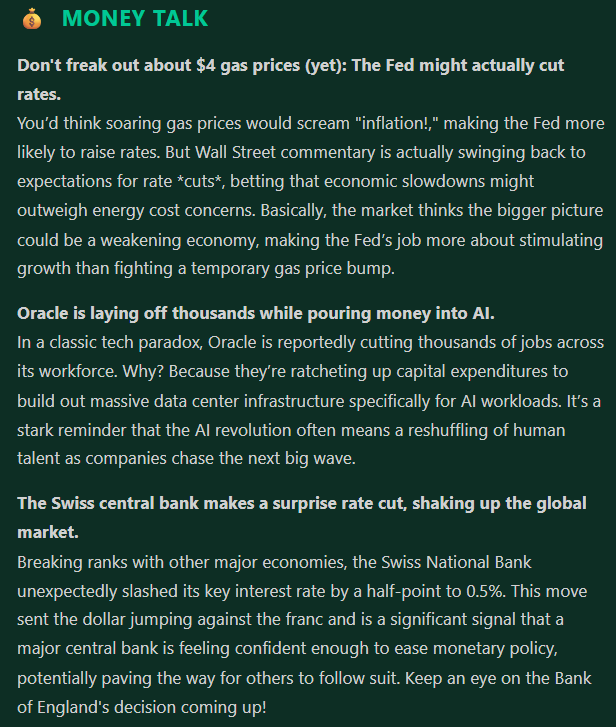

# The Daily Digest

> An AI-powered morning briefing — automatically fetched, summarized, and delivered to your inbox every day.


<!-- Replace with your actual screenshot -->

---

## What it does

Every morning at 8 AM, this pipeline:
1. Pulls ~75 articles from 17 RSS feeds across 5 categories
2. Sends them to Google Gemini 2.5 Flash to generate a concise, readable digest
3. Formats it into a styled HTML email
4. Delivers it to your inbox — no apps, no algorithms, no doomscrolling

The result: a sharp 5-minute read covering Finance, Geopolitics, Tech, Human Insights, and AI — written like a smart friend explaining the news over coffee.

---

## Tech Stack

| Layer | Technology |
|---|---|
| Language | Python |
| AI Summarization | Google Gemini 2.5 Flash (`google-genai` SDK) |
| Automation | GitHub Actions (`workflow_dispatch`) |
| Scheduling | cron-job.org → GitHub REST API |
| Email Delivery | Python `smtplib` over SMTP/SSL |
| Feed Parsing | `feedparser` |

---

## How it works

```
cron-job.org (8 AM PDT)
      │
      ▼
GitHub Actions workflow_dispatch
      │
      ▼
[1] Fetch — 17 RSS feeds → ~75 articles (last 36 hours only)
      │
      ▼
[2] Summarize — Gemini 2.5 Flash generates a structured digest
      │
      ▼
[3] Format — Custom Markdown → styled HTML email renderer
      │
      ▼
[4] Send — Gmail SMTP/SSL → inbox
```

---

## News Sources

| Category | Sources |
|---|---|
| 💰 Finance | CNBC, MarketWatch, Yahoo Finance, BBC Business, Guardian Business, Axios |
| 🌍 Geopolitics | NPR World, Foreign Policy, Deutsche Welle |
| ⚡ Tech | Hacker News, TechCrunch, The Verge, Wired |
| 🧠 Human Insights | Harvard Business Review, Psychology Today, The Cut, Big Think |
| 🤖 AI | TechCrunch AI, Ars Technica, Wired AI, VentureBeat AI, Anthropic Blog* |

*Anthropic Blog is only included when a new post was published in the last 24 hours.

---

## Engineering highlights

- **Reliable scheduling** — GitHub's free-tier cron silently skipped runs. Replaced with cron-job.org calling the `workflow_dispatch` API for guaranteed daily delivery.
- **Fresh content only** — Articles older than 36 hours are filtered out before the prompt is built, eliminating day-old news recycling.
- **Production-resilient API calls** — Exponential backoff on Gemini rate-limit (429) and availability (503) errors: 30s → 60s → 120s.
- **Cost-efficient** — Gemini 2.5 Flash keeps the per-run cost at ~$0.001.
- **Custom HTML email renderer** — Parses Gemini's Markdown output into a dark-themed, inline-CSS email with per-section color coding, compatible with major email clients.

---

## Skills demonstrated

- LLM integration & prompt engineering
- Automated pipeline design (fetch → process → deliver)
- REST API integration (GitHub Actions API, Google Gemini API)
- CI/CD with GitHub Actions
- HTML email rendering with inline CSS
- Error handling and retry logic for production resilience
- Secrets management in cloud environments

---

## Run it locally

```bash
git clone https://github.com/debjyoti-samanta-ind/daily-digest.git
cd daily-digest
pip install -r requirements.txt
```

Create a `.env` file:
```
GEMINI_API_KEY=your_key
GMAIL_ADDRESS=your_gmail
GMAIL_APP_PASSWORD=your_app_password
RECIPIENT_EMAIL=recipient@example.com
```

```bash
python digest.py
```
